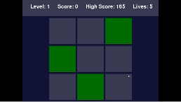

# Memory Challenge Game

## About
Memory Challenge is an engaging and addictive memory game designed to enhance cognitive skills. The game increases in complexity, providing an ever-evolving challenge to the player's memory.

## Demo

## Features
- **Progressive Difficulty**: The game becomes more challenging as you advance, making it endlessly engaging.
- **Memory Enhancement**: Designed to improve your memory by challenging you with increasingly complex levels.
- **User-Friendly Interface**: Simple and intuitive interface, ensuring a seamless gaming experience.
- **High Score Tracking**: Keeps track of your high scores to monitor your progress over time.
- **Dynamic Grid Sizes**: The grid size increases as you progress, adding to the complexity and fun.
- **Persistent Gameplay**: Your progress is saved, so you can pick up where you left off.

## Installation
To install and play the Memory Challenge game:
1. Clone this repository or download the ZIP file.
2. Open your terminal and navigate to the game directory.
3. Install the necessary Python packages:
pip install -r requirements.txt
4. Run the game: python memory_game.py

## Usage
- Start the game and try to memorize the positions of the highlighted squares.
- As the game progresses, the number of squares to remember increases.
- Use your memory skills to advance through levels and beat high scores.
- The game tests and improves your short-term memory and concentration.

## Contributing
We welcome contributions to the Memory Challenge game! Please read our [contributing guidelines](CONTRIBUTING.md) for details on how to contribute.

## License
This project is licensed under the [MIT License](LICENSE).

## Acknowledgments
- Thanks to all players and contributors who make this project possible.

## Sound Credits
- Sound effects used in this game were sourced from [Pixabay](https://www.pixabay.com).
- Special thanks to Pixabay for providing high-quality sounds that enhance the gaming experience.

## Contact
For any queries or suggestions, feel free to contact me.

## Version
Current version: 1.0